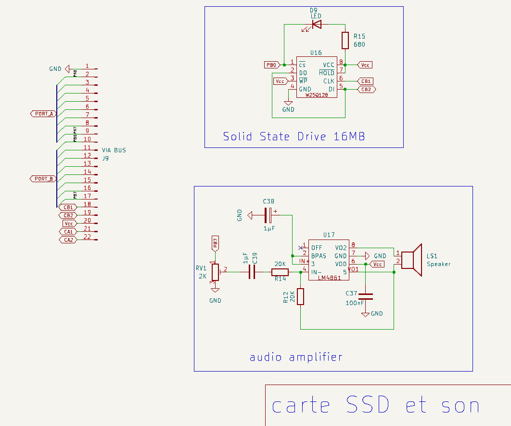
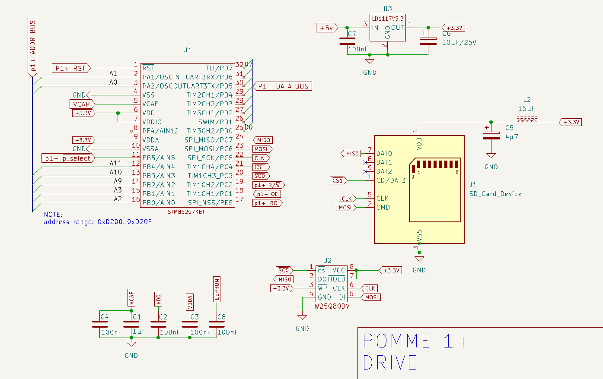

<!-- 
Copyright Jacques Deschênes, 2025
Ce document fait parti du projet pomme-1P
https://github.com/picatout/pomme-1P
-->

### 2025-06-10 

* **MON_V1.3R2** Modifié la boucle d'attente de fin de programmation de **EEWRITE**. La méthode utilisant la broche **1** de l'EEPROM ne fonctionne pas bien. La nouvelle routine utilise la comparaison de du contenu de l'EEPROM avec l'octet écrit. 

* Modifié fonction **MOVE** du moniteur pour que l'opération s'applique aussi à l'EEPROM U13. MON_V1.3R1 

* Modification de la circuit de l'ordinateur pomme-1+. Cette EEPROM peut-être programmée directement dans le circuit de l'ordinateur.
  * Ajout d'une EEPROM AT28BV64 dans le socket **U13**.
  * Utilisation du bit PB1 du VIA pour activer le **WRITE_ENABLE** de **U13**
  * Utilisation du bit PB2 du VIA pour lire l'état de la pin **1** de **U13** qui est a **0** lorsqu'une programmation est en cours.
* BIOS version 1.0R1
* p1+Monitor version 1.3R0.

### 2025-06-07 

* Travail sur [math16.s](BIOS/math16.s)

### 2025-06-06 

* Création de [math16.s](BIOS/math16.s)

* Ajout des routines **PRT_INT** et **UDIV16** dans [bios.s](BIOS/bios.s).


### 2025-05-23

* Modifié routinte **RESET** pour mettre à zéro les 2 piles.

### 2025-05-22

* débuter travail sur [forth.s](BIOS/forth.s).

* Création de macros qui prennent avantage des instructions du W65C02. Modification du code pour utiliser les macros.
  * BBRx, branch bit reset 
  * BBSx, branch bit set 
  * RMBx, reset memory bit 
  * SMBx, set memory bit  

### 2025-05-21

* Corrigé erreur dans la schématique de la carte .

### 2025-05-20 

* Paufiner le code du Moniteur. 
* Ajout au manuel [p1+Monitor.pdf](docs/p1+Monitor.pdf).

### 2025-05-19 

* Test mise à jour p1+Monitor.s 

* Ajout de fonctions à p1+Monitor.s 
  * range'M'dest   copie la plage mémoire *range* vers *dest*. 
  * range'V'dest   compare la page mémoire *range* à la plage débutant à *dest* et affiche les différences.
  * range'Z'   met à zéro la plage *range*.

* Création du manuel du [p1+Monitor](docs/p1+Monitor.pdf).


### 2025-05-15

* Travail sur le moniteur
  * Modifié **STORE_RANGE** et **LOAD_RANGE** pour étendre ces opération à une plage de plus de 256 octets.

### 2025-05-12

* Tavail sur le moniteur Version 1.1R0.

### 2025-05-07

* Changement d'organisation du firware BIOS 
   * création d'une pile des paramètres à l'adresse $C0..$FF 
   * Utilisation du registre **X** comme pointeur pour la pile des paramètres.
   * __Tout le code doit-être modifié pour tenir compte de cette modification.__
   * Ajout du fichier [stack.s](stack.s).
   * Le BIOS va fonctionné comme une machine FORTH. Le modèle d'exécution sera **direct threaded.**

### 2025-05-06 

* Travail sur BIOS 
  * Modifié l'utilisation des minuterie du **VIA** (W65C22).
    * TIMER1 utilisé comme générateur d'onde carré pour la fonction **TONE** du BIOS 
    * TIMER2 utilisé pour une interruption au milliseconde 
  * Ajout de la fonction BIOS **TONE**  

* Modification de la schématique, carte SSD + SON ajouté.

### 2025-05-03

* Poursuite du travail sur [p1+Monitor.s](BIOS/p1+Monitor.s).
  * Réussie à déboguer le moniteur 
* Ajout des commandes suivantes au moniteur:
  *	ADR'R'&lt;CR&gt;  run application at ADR 
  *	SECT#'X'&lt;CR&gt;  erase W25Q080 SECTOR# 
  *	'*'&lt;CR&gt;  erase W25Q080 chip  
  * ADR'!'PAGE&lt;CR&gt; store 256 memory bytes in W25Q080 flash memory 
  * ADR'@'PAGE&lt;CR&gt; load 256 bytes from W25Q080 to memory 
  *'Q'&lt;CR&gt; quit monitor 


### 2025-05-02

* Travail sur BIOS.
  * Tester **ENABLE_WRITE** et **FLASH_READ_STATUS**
  * Les problèmes avec la lecteur/écriture de la mémoire FLASH semblent réglés. j'avais une mauvaise compréhension des instruction d'indirection du MPU 6502.
  * Restauration du p1+Monitor 
  * Déplacer le p1+Monitor à l'adresse 0xFE00  car sa taille va augmenté par ajout de fonctionnalités.
    * ADR@PAGE  ssd page load at ADR  
    * ADR!PAGE  ssd store data at page 
    * SECTORX  erase ssd sector
    *  '*'  erasee chip  
    * Quoted string accepted as data to store functions. 

### 2025-05-01

* Travail sur BIOS.
  * Corrigé bogue matériel pin 32 du socket du VIA était mal soudée. 
  * Maintenant il est possible de lire le DEVICE ID correctement.
  * Fonction ERASE_ALL ne fonctionne pas. 
  * Fonction FLASH_WRITE ne fonctionne pas.
  * La fonction FLASH_READ semble fonctionner. À vérifier.

### 2025-04-30

* Travail sur le BIOS. Problème avec l'interface de la mémoire FLASH. 

### 2025-04-29

* Travail sur le BIOS. 
  * Ajout de **RAND** et **RANDOMIZE**. 

### 2025-04-28 

* Travail sur le BIOS.  Écriture des fonctions d'accès à la mémoire FLASH W25Q080.

### 2025-04-27

* Problème avec le W65C22S réglé, l'erreur était dans la conception matérielle. Les entrées **RWB** des W65C22S et W65C51S doivent-être alimentées directement par le signal **RWB** du MPU et on celui à la pin 8 de U3. 

* Repris le travail sur le BIOS.

### 2025-04-26

* Travail sur [bios](BIOS/bios.s). Le W65C22 ne fonctionne pas tous les signaux CS1,CS2B,PHI2 et R/WB  sont correct mais l'écriture des registres ne semble pas s'effectuer.


### 2025-04-25

* Travail sur [bios](BIOS/bios.s).

### 2025-04-24

* Corrigé erreur dans schématique du circuit de la mémoire FLASH W25Q080DV.

* Changement de direction, pour le moment j'ai abandonné le sous-projet **p1+_drive** pour fabriquer une carte contenant seulement la mémoire flash **W25Q080DV** de 1MO et qui et branchée directement sur un connecteur relié au PIA **W65C22**. Donc tous le firmware pour le stockage des programmes dans la mémoire flash cera programmé dans le BIOS du **pomme 1+.** 

. 


### 2025-04-09 

* Travail sur p1+_drive:
  * spi.asm complété. 
  * À faire drive_cmd.asm 

### 2025-03-19

* Modification du design 
  * Ajout d'un PIA **W65C22**  au peripheral board.
  * Modification de l'alimentation pour ajouter un régulateur de tension 3.3V.
  * Complété l'assemblage de la modification

  .jpg)
  
### 2025-03-18

* Modification du circuit du p1+_drive qui fonctionnera entièrment sur 3.3V au lieu de 5V.

* Montage partiel du p1+_drive sur carte sans soudure pour début programmation.


### 2025-03-16

* Corrigé schématique de p1+_drive, régulateur de tension 3.3V et adapteurs de niveaux ajoutés pour interfacé carte SD. 

* Remplacé le p1+_drive par un nouveau circuit utilisant un STM8S207K8T et une carte µSD pour le stockage des programmes.



* Modifié schématique du p1+_terminal. Ajout d'un transistor 2n3904 à la sortie TX pour permettre le partage de l'entrée ACIA_RX par plusieurs périphériques. Simulation d'un bus Open drain. 


### 2025-03-15

* J'ai pris la décision d'utiliser le même terminal que pour le pomme I avec quelques modifications.
  * la vitesse BAUD sera fixée à 115200
  * Les switches qui servaient à sélectionner le BAUD serviront à sélectionner un indentifiant de périphérique {0..3}.
  * Le terminal et le drive seront montés sur la même carte et utiliseront le même port sériel pour communiquer avec l'ACIA d'ou le besoin d'avoir un identifiant différent pour chacun d'eux. Les firmware du drive et du terminal ne répondront qu'aux messages identifiés par leur identifiant respectifs.
<hr>

* Travail sur la schématique et le firmware du **p1+_terminal**.

* Travail sur la schématique du **p1+_drive**.

### 2025-03-13

* Création du sous projet [p1+_drive](p1+_drive). 

### 2025-03-12

* Début du travails sur p1+_Terminal. Adaptation du [stm8_terminal](https://github.com/Picatout/stm8_terminal).


### 2025-03-11

* Complété schématique alimentation.

*Création d'une vidéo de présenstation du projet.

### 2025-03-08

* Moniteur V1.0R0 débogué et fonctionnel.

* Déboguer le moniteur 

### 2025-03-07

* Adaptation du moniteur WOZMON à l'ordinateur **pomme-1+**

* Ajout du fichier [docs/montage-pomme-1+.jpg](docs/montage-pomme-1+.jpg).


### 2025-02-13

* Début du projet **pomme-1P** construction d'un ordinateur simple basé sur le MPU W65C02S de [Western Design Center](https://www.westerndesigncenter.com/).


#### 2021-03-24

* Travail sur la documentation. 
  * Complété [manuel_util_tb.md](docs/manuel_util_tb.md)
  * Complété [user-manual.md](docs/user-manual.md)

* Ajout de la commande **DSTACK** et mise à jour des manuels de références français et anglais. 

#### 2021-03-23

* Ajouter support pour les interruptions écrite en BASIC. Annuler le transfert de la table des vecteurs au début de la RAM. À la place réserve 60*4 octets pour les adresses IRQ BASIC.


* Ajout de *nvic_enable_irq* et *nvic_disable_iqr* dans [stm32-tbi.s](stm32-tbi.s).

* Ajout de file de réception de 4 octets pour UART2|3. 

#### 2021-03-22

* Corrigé bogue dans [cmd_index.inc](command_index.inc).

#### 2021-03-21

* Mise à jour documentation [tbi_reference.md](docs/tbi_reference.md) et [refman.md](docs/refman.md).

* Mots ajoutés:  **UART_GETC**, **UART_INIT** et **UART_PUTC**. 

* Ajout support UART2 et UART3. 

* Modifié **WORDS** pour réduire la limite avant le retour à la ligne a 70 au lieu de 80. 

* Renommé programme pwm_soft.bas en [pwm-soft.bas](tb_progs/pwm-soft.bas) et modifié code. Maintenant commandes insensible à la casse. 

#### 2021-03-20
* Optimisation: Le compte des arguments est maintenant vérifié dans arg_list 
  plutôt que dans chaque commande ou fonction BASIC.

* Complété [refman.md](docs/refman.md).
#### 2021-03-19

* Modifié **PUT** pour inverser l'ordre des arguments, maintenant **PUT slot,value**.

* Modifié **GET** pour remplacer le **mul** par un **lsl**. 

* Travail sur [refman.md](docs/refman.md).

#### 2021-03-18

* Ajout de la commande **RANDOMIZE** et de sa docmentation. 

* Ajout de la documentation pour les commandes **SPI_xxx** dans [tbi_reference.md](tbi_reference.md).

* Réécriture de [spi-test.bas](tb_progs/spi-test.bas).

* Complété et testé les commandes du groupes **SPI_xxx**. 

* Added constants for GPIO modes in [stm32f103.inc](stm32f103.inc). 

#### 2021-03-17

* Travail sur commande **SPI_xxxx**. 

* Travail sur [refman.md](docs/refman.md) 

* Modifié **LOAD*** et *create_gap* qui ne mettait pas à jour la variable **HERE**.

#### 2021-03-16

* Travail sur [refman.md](docs/refman.md).

* Le mode GPIO pour les servo-moteur est maintenant **OUTPUT_AFOD** et requiert donc un résistance pull up externe branché à 5 volts. Ce changement est pour tenir compte de la différence de voltage d'alimentation entre MCU de la blue pill (3.3volts) et celui d'un petit servo-moteur qui est de 5 volts. 

* Modifié [servo-test.bas](tb_progs/servo-test.bas) pour tenir compte des 2 nouveaux canneaux. 

* Ajout des canneaux servo-moteurs 5 et 6. Modifié code et tester code. Note les canaux 5 et 6 ne peuvent-être utilisé en même temps que *TONE** est activé.  

#### 2021-03-15

* Création de **pwm_dc**.

* Création de la sous-routine **pwm_config**, facteur commun a **SERVO_INIT** et **TONE_INIT**.

* Corrigé bogue dans commande **AWU**.

* Travail sur [refman.md](docs/refman.md)

#### 2021-03-14

* Complété le manuel de référence.

#### 2021-03-13

* Travail sur le manuel de référence.

* Modifié fonction **RANDOM** pour refuser les entiers négatif.

#### 2021-03-12

* Travail sur manuel de référence.

* Corrigé bogue dand **readln**.

* Modification à la commande **AWU** contrôle de limite. 

* Modification à **ADC** pour ajouter délais après activation et calibration.

#### 2021-03-11

* Modifié *prt_chars* pour que les caractères ASCII>126 s'affiche comme un **'_'**. 

* Écris et testé commande  **AUTORUN**.

#### 2021-03-09

* Travail sur manuel de référence. 

* Corrigé bogue dans **term**. 

#### 2021-03-07

* Corrigé bogue dans **gpio_config**. 

* Ajout de **SERVO_OFF** pour désactiver un canal servo-moteur.

* Supprimer constantes **SERVO_x** maintenant **SERVO_INIT** et **SERVO_POS** prennent pour argument entiers {1..4}.

* Supprimer les constantes **ON** et **OFF**  maintenant les arguments {1|0} doivent-être utilisés.

#### 2021-03-06

* Modifié **SERVO_INIT** la configuration du GPIO utilisé est maintenant faite par cette commande.

* Ajout des mots **TONE_INIT**, **TONE**.

* Modifié **uart_init** pour ajouter verouillage de broches PA9,PA10.

#### 2021-03-05

* Corrigé erreur erronées pour les constantes système **OUTPUT_AFPP** et **OUTPUT_AFOD**.

* Ajout du programme [servo-tes.bas](tb_progs/servo-test.bas).

* Testé **SERVO_INIT** et **SERVO_POS**.

* Ajout du programme [gpio-tes.bas](tb_progs/gpio-test.bas)

* Désactivation de signaux **JTDI,JTDO,JTRST** qui empêchaient l'utilisation des **GPIOA:15,GPIOB:3,GPIOB:4**.

#### 2021-03-04

* Ajout des constantes système **SERVO_A**, **SERVO_B**, **SERVO_C** et **SERVO_D**.

* Ajout des mots **SERVO_INIT** et **SERVO_POS**. 


#### 2021-03-03

* Corrigé bogue dans fonction **READ** qui n'acceptait pas les entiers négatifs. 

* Supprimer la commande **DATALN** et remplacé par un argument de la commande **RESTORE**.

* Ajout des mots **ADC**,**ANA** 

* Ajout des constantes système: **ON**,**OFF**

* Ajout du programme [pmode-test.bas](tb_progs/pmode-test.bas).

#### 2021-03-02

* Corrigé bogue dans **decompile_line**,  lable were not decompressed properly. 

* Now accept underscore in label and keywords. 

* Ajout des constantes système **OUTPUT_OD**,**OUTPUT_PP**,**OUTPUT_AFOD**,**OUTPUT_AFPP**,**INPUT_FLOT**,**INPUT_PD**,**INPUT_PU** et **INPUT_ANA**

#### 2021-03-01

* Modifié **INPUT** pour accepter les entiers négatifs. 

* Modifié **ASC()** pour accepter les **TK_CFUNC** comme argument. 

* Modifié le type de la fonction **KEY** dans le dictionnaire de **TK_INTGR**  à **TK_CHAR**.

* Corrigé bogue dans **next_token** qui ne retournait pas **TK_QSTR** dans r0.

* Retravaillé  **relation** et **expression** ainsi que code dépendant. 

#### 2021-02-28

* Modifié **décompile_line** pour insérer espace après variable et fonction.

* Optimisé **next_token**. 

* Trouver bogue dans **decompile_line** qui m'a obligé à créer **TK_SCONST** pour distinguer les constantes système de celles-créées par l'utilisateur. Ajustement de code nécessaire.

* Création branche **interpreter** pour travaillé la performance de l'interpréteur.  


* Corrigé bogue dans **readln**  la commande **CTRL_E** ne fonctionnait plus, c'était un bogue régressif. 

#### 2021-02-27

* Débogué **DUMP**,  la pile était débalancée lorsque l'entrée se faisait au point **dump01**. 

* Ajout de **XPOS** et **YPOS** pour connaître la position actuelle du curseur à l'écran du terminal. 

* Renommé **SIZE** en **FREE** 

* Déboguage **relation**, **decompile_line**, **comp_token**. 

#### 2021-02-26

* Modification identifiants tokens et tout le code impliqué. 
* Modififié **GOSUB** et **RETURN** maintenant sauvegarde adresse retour sur pile principale au lieu de la pile des arguments. 
```
list
10  INPUT A,B
20  PUSH A,B GOSUB PROD
30  PRINT  POP
40  GOTO 10 
50 PROD PUSH  POP* POP  RETURN 
READY
RUN
A=23
B=67
1541 
A=
READY
```

* Débogué **readln**  **CTRL_R** ne fonctionnait plus. 

* Renommé les mots suivants: **PEEK8** en **PEEKB**, **PEEK16** en **PEEKH**  et **PEEK32** en **PEEKW**

* Renommé les mots suivants: **POKE8** en **POKEB**, **POKE16** en **POKEH** et **POKE32** en **POKEW** 

* Renommé le mot **FLASH** en **STORE** 

* Modifié **pasre_label**  le compilateur convertie les symboles qui représente des constantes dans le dictionaire comme des **TK_INTGER** maintenant. Exécution plus rapide.

#### 2021-02-25

* Ajout de **GPIOA**,**GPIOB**,**GPIOC**

* Renommé **INP** à **IN** 

* Ajout de **CLS** et **LOCATE** 

* Racourci **REMARK** à **REM**.

* Renommé  **PICK** **GET** et **STORE** **PUT** 

* nettoyage du code. 

* correction bogue dans **decompile_line**. 

* changer limite no de ligne pour 65535.

#### 2021-02-24

* exemple utiliation du mot **CONST** 
```
LIST
10  CONST CA=2 *3 ,CB=2 *CA
20  ? CA,CB
30  END 
READY
RUN
6 12 
READY
```

* exemple utilisant les mots de gestion de la pile des arguments ainsi que les étiquettes. 
```
list
10  FOR I=1  TO 10  PUSH I GOSUB SQUARE ?  POP , NEXT I
20  END 
30 SQUARE PUT  GET (2 )* GET (2 ),2  RETURN 
READY
run
1 4 9 16 25 36 49 64 81 100 
READY
```

* **TK_LBL**  Les étiquettes cibles pour les **GOTO** et **GOSUB** débute par le caractère **!** suivit d'un maximum de 6 lettres.

* Ajout de **CONST** et d'étiquettes cibles.

#### 2021-02-23

* Ajout de la variable système **HERE** dans le but d'ajouter le mot BASIC **CONST**. Le système va permettre de créer des constantes symboliques dans l'espace libre après le code BASIC.

* Ajout des mots BASIC **PUSH**,**POP**,**PICK**,**STORE** et **DROP**. 

```
a=ticks:for i=0 to 100000: next i:? ticks-a
433 

```

* Ajout des mots **FLASH** et **ERASE** 

#### 2021-02-22

* Modifié **uart_rx_handler** pour pour que **CTRL_B** branche directement sur **warm_start** à la sortie de l'isr.

#### 2021-02-20

* Ajout des commandes **DIR** et **LOAD** 

#### 2021-02-19

* Ajout de **SAVE** et **FORGET** 

* Corrigé bogue dans **readln** 

* Ajouté constantes pour **IWDG** et **WWDG** dans [stm32f103.inc](stm32f103.inc)

#### 2021-02-18

* Débogué **GOTO**, la variable **COUNT** n'était pas initialisée. 

* Remplacé **SHOW** par **TRACE** 

* Ajout des commandes **TAB** et **SPC** 

#### 2021-02-17

* Ajout de **SHOW** 

* Modifié **tb_error** maintenant rt_error affiche ligne décompilée. 

#### 2021-02-16

* Débuté travail sur **PMODE** 

* Modifié **PRINT** pour accepté le **;** comme séprateur de liste. Ce caractère sera utilisé pour engendré une tabulation. 

* Modifié **INPUT** pour accepter une lettre comme réponse. La lettre est convertie en majuscule et la valeur ASCII affectée à la variable.

#### 2021-02-15

* Ajout de **WAIT** ,**DREAD**,**DWRITE**,**OUT**,**INP** 

#### 2021-02-14

* Ajout de **SLEEP** et **STOP**, supprimer **BYE**
 
* Ajouter **KEY**, **RSHIFT**, **LSHIFT**,**PEEK8**,**PEEK16**,**PEEK32**,**POKE8**,**POKE16**,**POKE32**  

* Modifié **INPUT** pour afficher soit la chaîne, soit le nom de la variable mais pas les 2.

* Modifier readln, home ne doit pas retourner à gauche de l'écran mais au début de la ligne de texte qui ne débute pas forcément à la colonne 1.

#### 2021-02-13

* Ajout de **INPUT** et **INVERT**

* Améliorer **DUMP** ainsi que l'affichage des erreurs run time.

* Ajout de **CTRL_B** dans le gestionnaire **uart_rx_handler** pour stopper un programme bloqué dans une boucle indéfinie.

* Déboguer **decompile_line** et **readln**. 

#### 2021-02-12

* créer routine decompile reste à déboguer.

* Corrigé bogue dans **readln** 

* Ajout de **THEN**, **BIT** , **DO** , **UNTIL**

* Ajout de **CHAR** 

* Améliorer commmande **DUMP** pour aligner la colonne des octetes à la position 11.

* Améliorer **PRINT** pour tenir compte de la largeur des colonnes **TAB_WIDTH**.

#### 2021-02-11

* Ajout des fonctions BASIC **AND**,**OR**,**XOR**,**ASC** 

* Déboguer commande **PRINT** qui ne fesait le CR lorsque le dernier argument éait une expression.

* Ajout des mots BASIC  **DATA**,**DATALN**,**READ** et **RESTORE**.

* Déboguer fonctions d'éditions, **inster_line**, **create_gap**, **delete_line** 

* Corrigé **compile** qui ne traitait pas les commentaires correctement.

* Corrigé commande **LIST** qui n'affichait pas les commentaires.


#### 2021-02-10

* Déboguer **next_token** et **interpreter**.

* Écris et testé mots BASIC **TICKS**,**TIMER**,**TIMEOUT**,**PAUSE**,**NOT**

* Écris et testé mots BASIC **FOR**,**TO**,**STEP** et **NEXT**. 

* Écris et testé mots BASIC **GOSUB** et **RETURN**.

* Ajout de la commande BASIC **NEW**.

* Travail sur commande BASIC **LIST**. 

#### 2021-02-09

* Corrigé bogue dans **is_digit** 

* Modifié **next_token** et **interpreter**

#### 2021-02-08

* Tester et déboguer **relation**

* Écrire code pour commande **IF**. 

* Ajouter **DUMP** au vocabulaire BASIC 

* Compléter et tester commande **LET**.


#### 2021-02-05

* Modification de *parse_keyword* pour accepter les variables.
* Déboguer *expression* et *search_dict*
**À faire** 
* déboguer @(expr)

#### 2021-02-04

* Corrigé bogue dans *is_special* qui retournait la mauvaise la valeur.
* Corrigé bogue dans *skip* ne préservait pas **r1** et avancait **r3** avant vérification.
* Écriture de la commande BASIC **PRINT** 
 